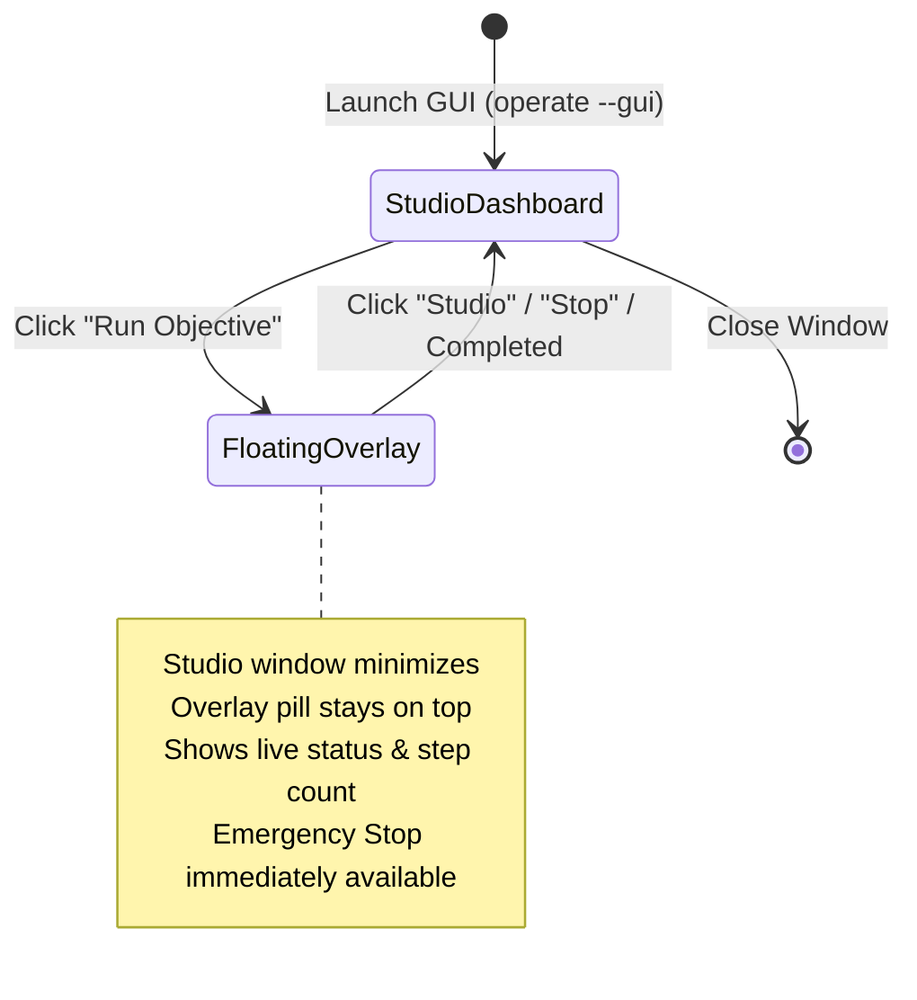

# Walkthrough: Custom API Support & Native Desktop Tkinter GUI

Implemented universal custom API and dynamic model support alongside a modern native desktop Tkinter GUI featuring a Full Studio Dashboard and a Mini Floating Overlay Controller.

---

## 1. Universal Custom API & Model Architecture

### What Changed:
* **Dynamic OpenAI-Compatible Base URL Support**:
  In [`operate/config.py`](file:///E:/Coding/Projects/self-operating-computer-anyAPI/operate/config.py), `Config.initialize_openai` dynamically connects to any `OPENAI_API_BASE_URL` (e.g. OpenRouter, LiteLLM, vLLM, Ollama, LM Studio, Groq).
* **Frictionless Local Execution**:
  If `OPENAI_API_BASE_URL` targets `localhost` or `127.0.0.1`, `Config.validation` automatically supplies a dummy key (`"none"`) if no API key is specified, preventing blocking prompts on local servers.
* **Universal Model Routing & Grounding Modes**:
  In [`operate/models/apis.py`](file:///E:/Coding/Projects/self-operating-computer-anyAPI/operate/models/apis.py), `get_next_action` now routes any unlisted custom model string dynamically to:
  - **EasyOCR Mode** (`<model>-ocr` or default): EasyOCR resolves clickable text elements directly on screen.
  - **Set-of-Mark Mode** (`<model>-som`): YOLOv8 visually boxes clickable controls with numeric tags.
  - **Direct Coordinates Mode** (`<model>-direct`): Model estimates normalized screen percentages.
* **Isolated Error Handling**:
  Custom models retry cleanly with explicit diagnostics on malformed outputs instead of falling back to official OpenAI `gpt-4o`.
* **Configurable Default Model**:
  In [`operate/main.py`](file:///E:/Coding/Projects/self-operating-computer-anyAPI/operate/main.py), defaults to `OPENAI_MODEL_NAME` from `.env` if provided.

---

## 2. Desktop Tkinter GUI Architecture (`operate/gui/`)

Built a 100% Python-native desktop GUI with dual-window orchestration:



### Components Created:
1. **[`operate/gui/studio.py`](file:///E:/Coding/Projects/self-operating-computer-anyAPI/operate/gui/studio.py)**:
   - **Provider Presets**: Instant auto-fill for Local Ollama, LM Studio, vLLM, OpenRouter, OpenAI, Claude, Gemini, and Qwen.
   - **Credential & Base URL Editor**: Modify and persist `.env` directly from the UI.
   - **Objective Prompt Box**: Multi-line objective input with max steps spinbox and visual mode picker.
   - **Real-Time Activity Console**: Colored live output stream for agent thoughts, actions, and status updates.
2. **[`operate/gui/overlay.py`](file:///E:/Coding/Projects/self-operating-computer-anyAPI/operate/gui/overlay.py)**:
   - Frameless, semi-transparent dark pill window with `wm_attributes("-topmost", True)`.
   - Draggable across monitors.
   - Real-time status dot (`●`), current action description (e.g. `[Step 2/10] Click: "Search"`), and immediate **Emergency Stop** button.
3. **[`operate/gui/app.py`](file:///E:/Coding/Projects/self-operating-computer-anyAPI/operate/gui/app.py)**:
   - Thread-safe coordination between the Tkinter main loop and the `operate` execution thread using `queue.Queue` and `threading.Event`.
4. **[`setup.py`](file:///E:/Coding/Projects/self-operating-computer-anyAPI/setup.py) & [`operate/main.py`](file:///E:/Coding/Projects/self-operating-computer-anyAPI/operate/main.py)**:
   - Added `--gui` CLI flag to `operate` command.
   - Registered `operate-gui` as an independent executable console script.

---

## 3. How to Launch & Use

### Launching the Desktop GUI:
```powershell
operate --gui
# or:
python -m operate.gui.app
# or:
operate-gui
```

### Using Any Custom OpenAI-Compatible Model via CLI:
```powershell
operate -m anthropic/claude-3.5-sonnet
```

### Sample `.env` Configuration:
```ini
OPENAI_API_BASE_URL="https://openrouter.ai/api/v1"
OPENAI_API_KEY="sk-or-v1-..."
OPENAI_MODEL_NAME="meta-llama/llama-3.2-11b-vision-instruct"
```
