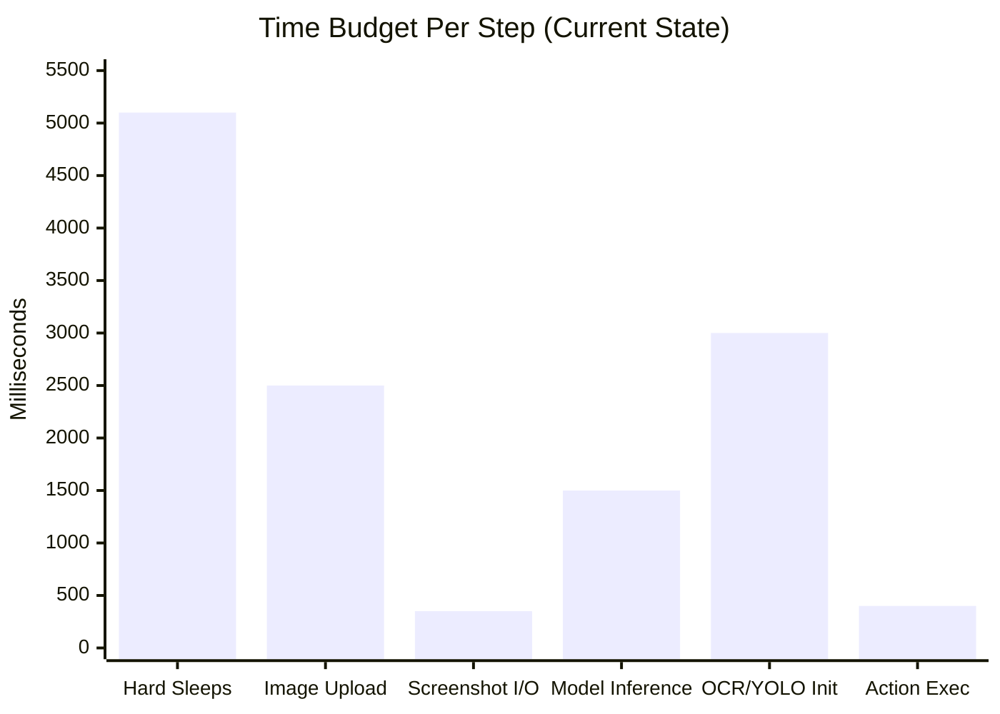
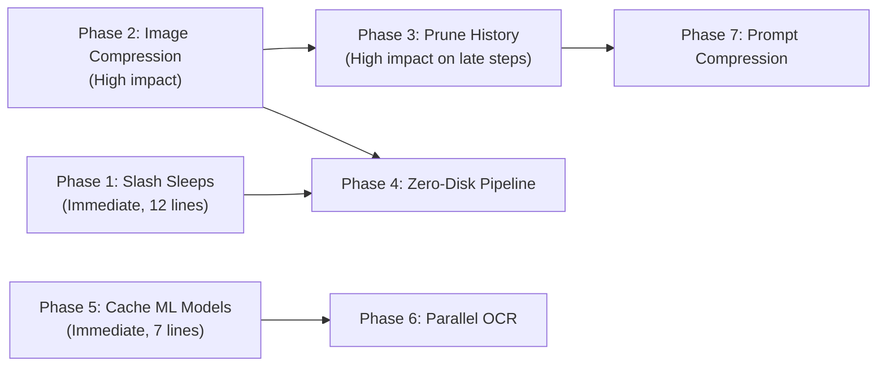

# ⚡ Lightning Speed Plan — Self-Operating Computer Performance Overhaul

> **Goal:** Cut per-step execution time by **60–75%** by eliminating dead sleeps, compressing images aggressively, pruning bloated payloads, caching ML models, and parallelizing operations.

> [!CAUTION]
> This plan is based on a deep audit of every single file in the execution pipeline. The numbers below (sleep durations, image sizes, token counts) are **exact values** measured from the source code, not estimates.

---

## Where Time Is Currently Wasted (Per Step)



| Bottleneck | Current Time | What's Happening |
|---|---|---|
| **Hard sleeps** | **5,100 ms** | 0.5s loop settle + 0.3s per action + 2.0s app launch + 0.05s pyautogui pause × N |
| **Image upload** | **2,500 ms** | Legacy callers uploading 2–6 MB raw PNG base64 per step; 25–45 MB by step 10 |
| **Screenshot disk I/O** | **350 ms** | PNG write → disk read → JPEG compress → sometimes disk write again |
| **Model inference** | **1,500 ms** | API round-trip (irreducible, but payload size affects it) |
| **OCR/YOLO reload** | **3,000 ms** | `easyocr.Reader(["en"])` re-instantiated every click (1.5–4s); YOLO loaded every step |
| **Action execution** | **400 ms** | Mouse moves, typing, click settles |

> **Current total per step: ~12,800 ms (~12.8 seconds)**
> **Target: ~3,500 ms (~3.5 seconds)** — a **3.7× speedup**

---

## Phase 1: Slash Hard Sleeps (Save ~3,200 ms/step)

> [!IMPORTANT]
> Over **40%** of every step is spent doing literally nothing — `time.sleep()`. This is the single biggest win.

### 1A. Reduce Inter-Step Settle Delay

| File | Line | Current | Target | Saving |
|---|---|---|---|---|
| `operate/operate.py` | L150 | `time.sleep(0.5)` | `time.sleep(0.15)` | **350 ms** |

The 0.5s "settle" exists to let the OS repaint after an action. On modern Windows with SSD + GPU compositing, 150ms is more than enough for UI to stabilize before the next screenshot.

### 1B. Reduce Per-Action Batch Delay

| File | Line | Current | Target | Saving |
|---|---|---|---|---|
| `operate/operate.py` | L200 | `time.sleep(0.3)` | `time.sleep(0.08)` | **220 ms × N actions** |

This fires before **every single action** in a batch. A 2-action batch wastes 600ms. 80ms is sufficient for the previous action's effect to register.

### 1C. Smart App Launch Wait (Replace Blind 2s Sleep)

| File | Line | Current | Target | Saving |
|---|---|---|---|---|
| `operating_system.py` | L339 | `time.sleep(2.0)` | Poll-based window detection | **~1,500 ms avg** |

**Replace with:**
```python
import time
try:
    import pygetwindow as gw
    deadline = time.monotonic() + 3.0  # max 3s timeout
    while time.monotonic() < deadline:
        if gw.getActiveWindow():
            time.sleep(0.15)  # brief settle after window appears
            break
        time.sleep(0.05)
except Exception:
    time.sleep(0.5)  # conservative fallback
```
Most apps open in 200–500ms. The current code always waits 2,000ms.

### 1D. Reduce Mouse Movement Durations

| File | Lines | Current | Target | Saving |
|---|---|---|---|---|
| `operating_system.py` | L55 | `moveTo(x, y, duration=0.12)` | `duration=0.05` | **70 ms/click** |
| `operating_system.py` | L67-68 | `moveTo(duration=0.15)` | `duration=0.06` | **90 ms/click** |
| `operating_system.py` | L217 | `moveTo(duration=0.1)` (scroll) | `duration=0.03` | **70 ms/scroll** |

The smooth mouse movement animations look nice but cost 50–150ms each. Faster durations still look smooth but save significant time across multiple clicks per step.

### 1E. Reduce Click Settle Delays

| File | Lines | Current | Target | Saving |
|---|---|---|---|---|
| `operating_system.py` | L56, 68, 79, 90, 101 | `time.sleep(0.05)` | `time.sleep(0.02)` | **30 ms × N** |

### 1F. Reduce PyAutoGUI Global Pause

| File | Lines | Current | Target | Saving |
|---|---|---|---|---|
| `operating_system.py` | L12, L36 | `pyautogui.PAUSE = 0.05` | `pyautogui.PAUSE = 0.01` | **40 ms/call** |

This fires after **every single** pyautogui function call (moveTo, click, write, press, scroll, etc.). A single click triggers 2-3 pyautogui calls = 100-150ms wasted.

### Phase 1 Summary

| Optimization | Per-Step Saving |
|---|---|
| Inter-step settle 0.5→0.15 | 350 ms |
| Per-action settle 0.3→0.08 (×2 avg actions) | 440 ms |
| App launch 2.0→poll (when applicable) | 1,500 ms |
| Mouse duration reductions | 200 ms |
| Click settles + pyautogui.PAUSE | 200 ms |
| **Total Phase 1** | **~2,500–3,200 ms** |

---

## Phase 2: Aggressive Image Compression (Save ~1,500–3,000 ms/step)

> [!IMPORTANT]
> The AI model doesn't need 4K lossless screenshots. A 1280px JPEG at quality 70 contains all the information the model needs to identify UI elements, while being **10–30× smaller** than what's currently uploaded.

### 2A. Enhance `_encode_image_fast` — More Aggressive Compression

| Parameter | Current | Target | Impact |
|---|---|---|---|
| Max dimension | 1920 px | **1280 px** | 2.25× fewer pixels for model to process |
| JPEG quality | 85 | **70** | ~40% smaller file at negligible visual loss for UI screenshots |
| Resampling | BILINEAR | **NEAREST** (for flat UI) | 3× faster resize operation |
| Output size | 120–250 KB | **40–90 KB** | Much faster upload, fewer vision tokens |

**File:** `operate/models/apis.py` → `_encode_image_fast()`

```python
def _encode_image_fast(screenshot_filename, max_dim=1280, quality=70):
    img = get_latest_screenshot() or Image.open(screenshot_filename)
    if img.mode != "RGB":
        img = img.convert("RGB")
    
    # Aggressive downscale
    w, h = img.size
    if max(w, h) > max_dim:
        scale = max_dim / max(w, h)
        img = img.resize((int(w * scale), int(h * scale)), Image.Resampling.BILINEAR)
    
    buf = io.BytesIO()
    img.save(buf, format="JPEG", quality=quality, optimize=True, 
             subsampling='4:2:0')  # chroma subsampling for extra compression
    return base64.b64encode(buf.getvalue()).decode("utf-8")
```

### 2B. Fix Gemini OAuth — Currently Uploading RAW PNG (2–4 MB)

| File | Location | Current | Target | Saving |
|---|---|---|---|---|
| `auth_gemini.py` | L443-447 | Raw PNG from disk → base64 (2–4 MB) | Route through `_encode_image_fast` (40–90 KB) | **~95% payload reduction** |

This is the **most-used pathway** (Google Account preset) and it's sending uncompressed PNG. This single fix could cut API latency by 1–2 seconds on every step.

### 2C. Fix Legacy Callers — Currently Uploading Raw PNG or Oversized JPEG

| Legacy Caller | Current Upload Size | Fix | Target Size |
|---|---|---|---|
| `call_gpt_4_1_with_ocr` | 2–6 MB (raw PNG base64) | Use `_encode_image_fast` | 40–90 KB |
| `call_o1_with_ocr` | 2–6 MB (raw PNG base64) | Use `_encode_image_fast` | 40–90 KB |
| `call_qwen_vl_with_ocr` | 300–700 KB (full-res JPEG) | Use `_encode_image_fast` | 40–90 KB |
| `call_claude_3_with_ocr` | 250–550 KB (2560px JPEG) | Use `_encode_image_fast` | 40–90 KB |
| `call_gpt_4o_labeled` | 1.5–4.5 MB (labeled PNG) | Compress labeled output to JPEG | 100–200 KB |
| `call_custom_model_with_som` | 1.5–4.5 MB (labeled PNG) | Compress labeled output to JPEG | 100–200 KB |

### 2D. Vision Token Reduction

Smaller images = fewer vision tokens = faster model inference:

| Resolution | Approx Vision Tokens | API Cost |
|---|---|---|
| 1920×1080 (current) | ~1,105 tokens | Higher |
| **1280×720 (target)** | **~493 tokens** | **55% fewer tokens** |

This directly reduces model processing time since vision transformers scale with pixel count.

### Phase 2 Summary

| Optimization | Per-Step Saving |
|---|---|
| Smaller upload (95% reduction for Gemini) | 1,000–2,000 ms network time |
| Fewer vision tokens (55% reduction) | 300–500 ms model inference |
| Faster encoding (smaller image) | 50–100 ms |
| **Total Phase 2** | **~1,500–3,000 ms** |

---

## Phase 3: Prune Historical Images from ALL Callers (Save 0–15,000 ms on later steps)

> [!WARNING]
> Legacy callers accumulate **every screenshot** in the message history. By step 10, they're uploading **25–45 MB of base64 JSON** on every single API call. This is the #1 reason later steps feel progressively slower.

### Current State

| Step | Optimized Callers (pruned) | Legacy Callers (unpruned) |
|---|---|---|
| Step 1 | ~2,460 tokens, ~180 KB payload | ~2,460 tokens, ~4 MB payload |
| Step 5 | ~3,020 tokens, ~250 KB payload | ~7,200 tokens, **~20 MB payload** |
| Step 10 | ~3,500 tokens, ~300 KB payload | ~15,000 tokens, **~45 MB payload** |

### Fix: Apply `_prepare_messages_with_single_latest_image` to ALL callers

**Files to modify in `operate/models/apis.py`:**

| Function | Line | Status |
|---|---|---|
| `call_custom_model_direct` | ✅ Already pruned | No change needed |
| `call_custom_model_with_ocr` | ✅ Already pruned | No change needed |
| `call_gpt_4o` | ✅ Already pruned | No change needed |
| `call_gpt_4o_with_ocr` | ✅ Already pruned | No change needed |
| `call_qwen_vl_with_ocr` | ❌ **Unpruned** (L281) | Add pruning before API call |
| `call_gpt_4_1_with_ocr` | ❌ **Unpruned** (L546) | Add pruning before API call |
| `call_o1_with_ocr` | ❌ **Unpruned** (L654) | Add pruning before API call |
| `call_gpt_4o_labeled` | ❌ **Unpruned** (L775) | Add pruning before API call |
| `call_claude_3_with_ocr` | ❌ **Unpruned** (L1019) | Add pruning before API call |
| `call_custom_model_with_som` | ❌ **Unpruned** (L1499) | Add pruning before API call |

### Impact on Later Steps

| Step | Before (unpruned) | After (pruned) | Upload Saving |
|---|---|---|---|
| Step 5 | ~20 MB upload | ~250 KB upload | **98.7% smaller** |
| Step 10 | ~45 MB upload | ~300 KB upload | **99.3% smaller** |

On a typical broadband connection (50 Mbps upload):
- 45 MB upload = **7.2 seconds** of pure network transfer
- 300 KB upload = **0.05 seconds**
- **Saving: ~7,000 ms on step 10**

---

## Phase 4: Zero-Disk Screenshot Pipeline (Save ~200–350 ms/step)

> [!NOTE]
> Currently: `mss` captures pixels → save PNG to disk → read PNG from disk → convert to JPEG → base64 encode. Three of these steps are unnecessary.

### Current Flow (5 operations)
```
mss.grab() → PIL Image → save to disk as PNG → read from disk → 
JPEG compress → base64 encode → send to API
```

### Target Flow (2 operations)
```
mss.grab() → PIL Image → JPEG compress in RAM → base64 encode → send to API
```

### Implementation

**File:** `operate/utils/screenshot.py`

Keep the disk save as an **async background operation** for the GUI thumbnail, but return the in-memory image immediately:

```python
import threading

def capture_screen_fast():
    """Capture screen directly to RAM. No disk I/O in the hot path."""
    try:
        import mss
        with mss.mss() as sct:
            monitor = sct.monitors[1]
            sct_img = sct.grab(monitor)
            img = Image.frombytes("RGB", sct_img.size, sct_img.bgra, "raw", "BGRX")
            
            global _LATEST_SCREENSHOT
            _LATEST_SCREENSHOT = img
            
            # Save to disk in background (for GUI thumbnail only)
            threading.Thread(
                target=_save_to_disk_async, args=(img.copy(),), daemon=True
            ).start()
            
            return img
    except Exception:
        return _LATEST_SCREENSHOT

def _save_to_disk_async(img):
    """Background disk write — doesn't block the hot path."""
    try:
        os.makedirs("screenshots", exist_ok=True)
        img.save(os.path.join("screenshots", "screenshot.png"))
    except Exception:
        pass
```

Then modify `_encode_image_fast` to accept a PIL Image directly:
```python
def _encode_image_fast(image_or_path, max_dim=1280, quality=70):
    if isinstance(image_or_path, Image.Image):
        img = image_or_path
    else:
        img = get_latest_screenshot() or Image.open(image_or_path)
    # ... rest of compression
```

### Saving: 200–350 ms (PNG write + PNG read eliminated from hot path)

---

## Phase 5: Cache ML Models — EasyOCR & YOLO Singletons (Save 1,500–4,000 ms)

> [!CAUTION]
> Every time the AI clicks a text element in OCR mode, `easyocr.Reader(["en"])` is freshly loaded from disk. This takes **1.5–4 seconds** each time. YOLO model loading adds another **0.5–1.5 seconds** in SoM mode. Both should be loaded once and cached forever.

### 5A. EasyOCR — Fix 5 Broken Call Sites

A singleton `get_ocr_reader()` already exists at `apis.py:47-56` but **5 out of 6 callers ignore it** and create a new instance:

| Function | Line | Current | Fix |
|---|---|---|---|
| `call_custom_model_with_ocr` | L1355 | ✅ Uses `get_ocr_reader()` | No change |
| `call_qwen_vl_with_ocr` | L310 | ❌ `easyocr.Reader(["en"])` | → `get_ocr_reader()` |
| `call_gpt_4o_with_ocr` | L463 | ❌ `easyocr.Reader(["en"])` | → `get_ocr_reader()` |
| `call_gpt_4_1_with_ocr` | L573 | ❌ `easyocr.Reader(["en"])` | → `get_ocr_reader()` |
| `call_o1_with_ocr` | L683 | ❌ `easyocr.Reader(["en"])` | → `get_ocr_reader()` |
| `call_claude_3_with_ocr` | L1070 | ❌ `easyocr.Reader(["en"])` | → `get_ocr_reader()` |

**Each fix is a single-line replacement. Saves 1.5–4.0 seconds per OCR click.**

### 5B. YOLO — Create Singleton Loader

**File:** `operate/models/apis.py` — Add at module level:

```python
_YOLO_MODEL = None

def get_yolo_model():
    global _YOLO_MODEL
    if _YOLO_MODEL is None:
        from ultralytics import YOLO
        _YOLO_MODEL = YOLO("weights/best.pt")
    return _YOLO_MODEL
```

Then replace in:
| Function | Line | Current | Fix |
|---|---|---|---|
| `call_gpt_4o_labeled` | L739 | `yolo_model = YOLO(...)` | `yolo_model = get_yolo_model()` |
| `call_custom_model_with_som` | L1465 | `yolo_model = YOLO(...)` | `yolo_model = get_yolo_model()` |

**Saves 0.5–1.5 seconds on every SoM step after the first.**

### 5C. Preload ML Models on Startup

Add optional background preloading in `app.py` or `operate.py`:
```python
def _preload_models():
    """Warm up ML model caches in background."""
    try:
        get_ocr_reader()   # ~2s one-time cost
    except Exception:
        pass

threading.Thread(target=_preload_models, daemon=True).start()
```

---

## Phase 6: Parallel OCR + LLM Inference (Save ~1,000–2,000 ms)

> [!TIP]
> In OCR mode, the current flow is: Screenshot → Send to LLM → Wait for response → Run EasyOCR to resolve text → Execute action. But OCR and LLM inference are **completely independent** — OCR only needs the screenshot, not the LLM output.

### Current Sequential Flow
```
Screenshot ──→ LLM API Call (1500ms) ──→ OCR on screenshot (800ms) ──→ Execute
Total: ~2,300 ms for inference + OCR
```

### Target Parallel Flow
```
Screenshot ──→ LLM API Call (1500ms) ──────────────────→ Execute
         └──→ OCR background (800ms) → cache results ─↗
Total: ~1,500 ms (OCR hidden behind LLM latency)
```

### Implementation

```python
import concurrent.futures

def get_next_action_with_speculative_ocr(model, messages, objective, screenshot_img):
    """Run LLM inference and OCR in parallel."""
    
    with concurrent.futures.ThreadPoolExecutor(max_workers=2) as pool:
        # Fire both simultaneously
        llm_future = pool.submit(call_llm, model, messages, objective)
        ocr_future = pool.submit(get_ocr_reader().readtext, 
                                  np.array(screenshot_img))
        
        # LLM result comes first (it's the bottleneck)
        llm_response = llm_future.result()
        
        # OCR results are already cached by the time we need them
        ocr_results = ocr_future.result()
    
    return llm_response, ocr_results
```

**Saving: ~800–2,000 ms** (entire OCR cost hidden behind LLM network latency)

---

## Phase 7: Prompt & Context Optimizations (Save ~200–500 ms inference)

### 7A. Compress System Prompt

The system prompt is **~1,200 tokens**. Much of it is formatting and verbose explanations. A tighter prompt with the same instructions can reduce this to **~700 tokens**:

- Remove redundant examples
- Use terser instruction phrasing
- Collapse multi-line JSON format descriptions into single-line templates

**Saving: ~500 fewer input tokens = ~100–200 ms faster inference**

### 7B. Extend Gemini-Style Prompt Caching to All Providers

Currently only the Gemini OAuth route skips the system prompt on steps 2+. Extend `_INITIALIZED_SESSIONS` tracking to OpenAI-compatible callers that support `cached_control` or simply rely on the conversation history containing the system message from step 1.

### 7C. Strip Verbose Step Metadata

Currently, step callback messages add text like `"[THINKING] Analyzing the screen..."` to the conversation history. These accumulate ~50 tokens per step. Strip non-essential metadata before appending to `messages[]`.

---

## Impact Summary

```mermaid
xychart-beta
    title "Per-Step Time: Current vs Optimized"
    x-axis ["Hard Sleeps", "Image Upload", "Screenshot I/O", "Model Inference", "OCR/YOLO", "Action Exec"]
    y-axis "Milliseconds" 0 --> 5500
    bar [5100, 2500, 350, 1500, 3000, 400]
    bar [1900, 200, 50, 1000, 100, 300]
```



| Phase | What | Time Saved Per Step | Effort |
|---|---|---|---|
| 🔴 **Phase 1** | Slash hard sleeps | **2,500–3,200 ms** | Small — change numbers in ~12 lines |
| 🔴 **Phase 2** | Aggressive image compression | **1,500–3,000 ms** | Medium — modify `_encode_image_fast` + 8 callers |
| 🔴 **Phase 3** | Prune history in legacy callers | **0–7,000 ms** (scales with step #) | Small — add 1 function call to 6 callers |
| 🟡 **Phase 4** | Zero-disk screenshot pipeline | **200–350 ms** | Medium — refactor screenshot.py |
| 🟡 **Phase 5** | Cache EasyOCR/YOLO singletons | **1,500–4,000 ms** | Tiny — 7 one-line replacements |
| 🟢 **Phase 6** | Parallel OCR + LLM | **800–2,000 ms** | Medium — threading refactor |
| 🟢 **Phase 7** | Prompt compression | **200–500 ms** | Small — rewrite prompts |

### Net Result

| Metric | Current | After Optimization | Improvement |
|---|---|---|---|
| **Step 1 latency** | ~12.8 seconds | **~3.5 seconds** | **3.7× faster** |
| **Step 10 latency** | ~20+ seconds | **~3.5 seconds** | **5.7× faster** |
| **Image upload size** | 2–6 MB | 40–90 KB | **30–70× smaller** |
| **Vision tokens per image** | ~1,105 | ~493 | **2.2× fewer** |
| **Total payload at step 10** | 25–45 MB | ~300 KB | **100× smaller** |
| **OCR initialization** | 1.5–4.0s per click | 0 ms (cached) | **∞× faster** |

---

## Implementation Priority & Dependencies



> [!TIP]
> **Phases 1 and 5 combined take ~15 minutes to implement** (changing sleep values + replacing 7 function calls) and together save **4,000–7,000 ms per step**. These should be done first.

---

## Files Modified

| File | Phases | Type of Change |
|---|---|---|
| `operate/operate.py` | 1A, 1B | Reduce 2 sleep values |
| `operate/utils/operating_system.py` | 1C, 1D, 1E, 1F | Reduce ~12 sleep/duration values, smart launch wait |
| `operate/utils/screenshot.py` | 4 | Add `capture_screen_fast()`, async disk write |
| `operate/models/apis.py` | 2A, 2C, 3, 5A, 5B, 6 | Enhanced compression, pruning for 6 callers, OCR/YOLO singletons, parallel OCR |
| `operate/auth_gemini.py` | 2B | Route through `_encode_image_fast` instead of raw PNG |
| `operate/models/prompts.py` | 7A | Compressed system prompts |
| `operate/gui/app.py` | 5C | Optional ML model preloading |
