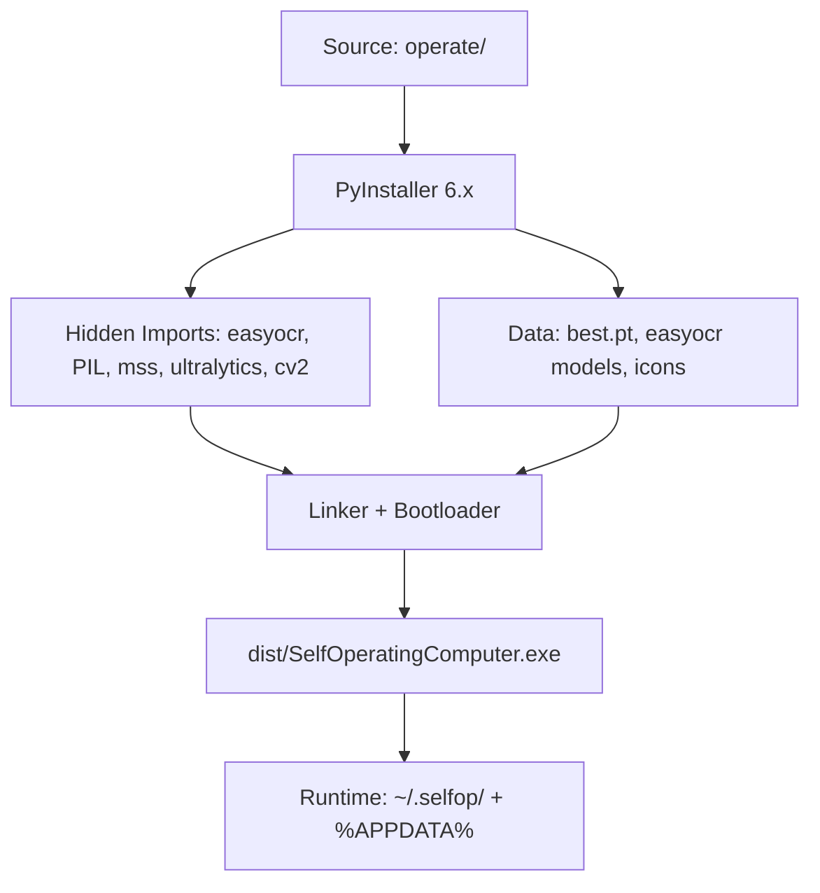

# Implementation Plan — Part 2: Latency Fix, API Key Persistence, GUI Enhancements, .EXE Blueprint

> This is **Part 2** of 2. Covers everything **except** `auth_gemini.py` (which is in Part 1).

---

## Summary

| # | Component | Type | Files |
|---|-----------|------|-------|
| 2 | Latency & multi-image fix | Modify | `operate/models/apis.py`, `operate/operate.py` |
| 3 | Multi-provider API key persistence | Modify | `operate/gui/studio.py`, `operate/config.py` |
| 4 | GUI enhancements | Modify | `operate/gui/studio.py`, `operate/gui/app.py` |
| 5 | .EXE packaging blueprint | Plan only | No code changes |

---

## Component 2: Latency & Multi-Image Fix

### What Already Works (No Changes Needed)

These exist in [apis.py L1211-L1272](file:///E:/Coding/Projects/self-operating-computer-anyAPI/operate/models/apis.py#L1211-L1272) and are already used by the custom model callers:

| Helper | Line | Used by |
|--------|------|---------|
| `_encode_image_fast()` | L1211 | `call_custom_model_with_ocr` (L1290), `call_custom_model_direct` (L1396) |
| `_prepare_messages_with_single_latest_image()` | L1241 | Same two callers (L1297, L1403) |

**The custom model callers you use daily via OmniRoute are already optimized.**

---

### Fix 2.1: Extend Image Pruning to Legacy Callers

These 8 legacy functions still do `messages.append(vision_message)` directly, causing every historical screenshot base64 to be re-sent on each step:

| Function | Line | Adds raw image to history? |
|----------|------|---------------------------|
| `call_gpt_4o()` | L156 | ✅ Yes — piles up |
| `call_qwen_vl_with_ocr()` | L238 | ✅ Yes |
| `call_gpt_4o_with_ocr()` | L407 | ✅ Yes |
| `call_gpt_4_1_with_ocr()` | L520 | ✅ Yes |
| `call_o1_with_ocr()` | L629 | ✅ Yes |
| `call_gpt_4o_labeled()` | L752 | ✅ Yes |
| `call_claude_3_with_ocr()` | L998 | ✅ Yes (Anthropic format) |
| `call_gemini_pro_vision()` | L333 | ✅ Yes (genai format) |

**Approach — fix the 3 most common first:**

#### `call_gpt_4o()` (L119-L194)
Replace:
```python
# OLD (L130-L156):
with open(screenshot_filename, "rb") as img_file:
    img_base64 = base64.b64encode(img_file.read()).decode("utf-8")
...
vision_message = { "role": "user", "content": [...] }
messages.append(vision_message)
...
response = call_with_retry(client.chat.completions.create, model="gpt-4o", messages=messages, ...)
```
With:
```python
img_base64 = _encode_image_fast(screenshot_filename)
...
api_messages = _prepare_messages_with_single_latest_image(messages, user_prompt, img_base64)
...
response = call_with_retry(client.chat.completions.create, model="gpt-4o", messages=api_messages, ...)
```

#### `call_gpt_4o_with_ocr()` (L372-L483)
Same pattern — replace `messages.append(vision_message)` + passing `messages` to API with `_prepare_messages_with_single_latest_image()` + passing `api_messages`.

#### `call_gemini_pro_vision()` (L316-L369)
This uses the `google-generativeai` SDK with `model.generate_content([prompt, Image])`, not OpenAI format. The image is a PIL object, not base64 in messages. **No pruning change needed** — it already sends a single image per call. But the `time.sleep(1)` calls at L325 and L335 should be removed.

**Remaining 5 callers**: Fix in a follow-up pass. They're for specific model strings (`gpt-4.1-with-ocr`, `o1-with-ocr`, `qwen-vl`, `claude-3`, `gpt-4-with-som`) that are less commonly used through the GUI.

---

### Fix 2.2: Remove 12 Redundant `time.sleep(1)` in `apis.py`

All confirmed locations:

| Line | Inside function |
|------|----------------|
| 122 | `call_gpt_4o()` |
| 203 | `call_qwen_vl_with_ocr()` |
| 325 | `call_gemini_pro_vision()` |
| 335 | `call_gemini_pro_vision()` |
| 378 | `call_gpt_4o_with_ocr()` |
| 491 | `call_gpt_4_1_with_ocr()` |
| 600 | `call_o1_with_ocr()` |
| 709 | `call_gpt_4o_labeled()` |
| 856 | `call_ollama_llava()` |
| 935 | `call_claude_3_with_ocr()` |

**Action**: Remove all 12. The retry handler (`call_with_retry`) already manages rate-limit backoff with exponential delays. These sleeps just add 1 second of dead wait before each request starts.

---

### Fix 2.3: Reduce Sleeps in `operate.py`

| Location | Current | Proposed | Why |
|----------|---------|----------|-----|
| [L149](file:///E:/Coding/Projects/self-operating-computer-anyAPI/operate/operate.py#L149) — main loop, between steps | `time.sleep(1.0)` | `time.sleep(0.5)` | Enough for Windows UI to settle; 0.3s risks mid-animation screenshots |
| [L199](file:///E:/Coding/Projects/self-operating-computer-anyAPI/operate/operate.py#L199) — per-action, between operations in a batch | `time.sleep(1)` | `time.sleep(0.3)` | Click/type complete instantly; 0.3s is sufficient for OS to register |

**Net savings per step**: ~2.5s of dead wait eliminated. Over 10 steps: **~25 seconds saved**.

---

## Component 3: Multi-Provider API Key Persistence

### Problem

[`_on_preset_change()`](file:///E:/Coding/Projects/self-operating-computer-anyAPI/operate/gui/studio.py#L592-L655) overwrites the API key field with hardcoded defaults on every switch. [`_save_config_to_env()`](file:///E:/Coding/Projects/self-operating-computer-anyAPI/operate/gui/studio.py#L676-L718) only saves `OPENAI_API_KEY`. Switching providers erases keys.

### Fix

#### 3.1 Add in-memory key cache to `StudioWindow.__init__`
```python
self._provider_keys = {}   # {"OpenAI Official": "sk-...", "Google Gemini": "AIza..."}
self._current_preset = "Custom (OpenAI-compatible)"
```

#### 3.2 Provider → env var mapping
```python
PROVIDER_KEY_MAP = {
    "Custom (OpenAI-compatible)": "OPENAI_API_KEY",
    "OpenAI Official":           "OPENAI_API_KEY",
    "Google Gemini":             "GOOGLE_API_KEY",
    "Anthropic Claude":          "ANTHROPIC_API_KEY",
    "Alibaba Qwen":              "QWEN_API_KEY",
    "OpenRouter":                "OPENROUTER_API_KEY",
    "Local Ollama (localhost:11434)":   None,
    "Local LM Studio (localhost:1234)": None,
    "Local vLLM (localhost:8000)":      None,
    "Local OmniRoute (localhost:20128)": None,
}
```

#### 3.3 Modify `_on_preset_change()`
1. **Before switching**: `self._provider_keys[self._current_preset] = self.api_key_entry.get().strip()`
2. **After switching**: Load from `self._provider_keys.get(new_preset)` → fall back to `os.getenv(PROVIDER_KEY_MAP[new_preset])` → fall back to `""`
3. Local presets still inject their hardcoded dummy keys (no change there)
4. Update `self._current_preset = new_preset`

#### 3.4 Modify `_save_config_to_env()`
- Write all provider-specific env vars that have values
- Write `OPENAI_API_KEY` + `OPENAI_API_BASE_URL` mapped to the active provider (backwards compat)
- Write `ACTIVE_PROVIDER_PRESET="{name}"` for restore on relaunch

#### 3.5 Modify `_load_saved_config()`
- Read `ACTIVE_PROVIDER_PRESET` and set `self.preset_var`
- Populate `self._provider_keys` from all known env vars
- Trigger `_on_preset_change()` to fill fields for the active preset

---

## Component 4: GUI Enhancements

### What Already Exists (No Changes)
- ✅ Dark zinc theme (`#09090b` / `#18181b` / `#27272a`) — [studio.py L68-L85](file:///E:/Coding/Projects/self-operating-computer-anyAPI/operate/gui/studio.py#L68-L85)
- ✅ Colored log tags — [studio.py L401-L407](file:///E:/Coding/Projects/self-operating-computer-anyAPI/operate/gui/studio.py#L401-L407)
- ✅ Google OAuth panel (connect/disconnect/exchange) — [studio.py L418-L512](file:///E:/Coding/Projects/self-operating-computer-anyAPI/operate/gui/studio.py#L418-L512)
- ✅ Floating overlay with drag + step counter — [overlay.py](file:///E:/Coding/Projects/self-operating-computer-anyAPI/operate/gui/overlay.py)

### New: Step Progress Bar
Add between prompt card and log card in `_build_ui()`:
```python
self.progress_frame = tk.Frame(main_container, bg=self.c_bg)
self.progress_frame.pack(fill="x", pady=(0, 8))

self.progress_label = tk.Label(
    self.progress_frame, text="Step 0 / 0",
    font=("Segoe UI", 8), fg=self.c_text_muted, bg=self.c_bg
)
self.progress_label.pack(side="left", padx=(4, 8))

self.progress_bar = ttk.Progressbar(
    self.progress_frame, maximum=10, value=0, length=200
)
self.progress_bar.pack(side="left", fill="x", expand=True)
```

Update in `_process_events()` when `ev_type == "status"` has `step` and `max_steps`:
```python
self.progress_bar["maximum"] = max_steps
self.progress_bar["value"] = step
self.progress_label.config(text=f"Step {step} / {max_steps}")
```

### New: Screenshot Thumbnail
Small preview (320×180) inside the log card:
```python
self.screenshot_label = tk.Label(log_card, bg="#111114", width=320, height=180)
self.screenshot_label.pack(side="right", padx=8, pady=8)
```
Updated via event queue when a new screenshot is captured — use `PIL.ImageTk.PhotoImage` to render a scaled-down version.

### Modify: Rewire OAuth Panel to `auth_gemini.py`
The current OAuth panel in [studio.py L418-L512](file:///E:/Coding/Projects/self-operating-computer-anyAPI/operate/gui/studio.py#L418-L512) uses the old `operate.utils.google_auth.GoogleOAuthManager` with a manual "paste code + exchange" flow.

**Changes:**
1. Replace `_oauth_open_consent()` → run `operate.auth_gemini.oauth_login()` in a background thread (it handles the full flow automatically via local HTTP callback)
2. Remove the paste-code `Entry` widget and "Exchange" button — no longer needed
3. Simplify panel to: `[🔗 Login with Google]` + status label + `[Disconnect]`
4. Add `☑ Use Gemini OAuth` checkbox → sets/unsets `os.environ["GEMINI_OAUTH"]`
5. On successful login, update status: `🟢 Connected` and show user email if available from token response

---

## Component 5: .EXE Packaging Blueprint (Plan Only)

### Architecture


### Challenges & Solutions

| Challenge | Solution |
|-----------|----------|
| PyTorch bloat (1.5GB+) | Exclude `torch.distributed`, `caffe2`, CUDA; CPU-only |
| EasyOCR model files | `--collect-data easyocr` |
| OpenCV DLLs | `--collect-binaries cv2` |
| YOLO weights | `--add-data "operate/models/weights/best.pt;operate/models/weights"` |
| Frozen exe read-only dir | `.env` → `%APPDATA%\SelfOperatingComputer\`; tokens → `~/.selfop/` |

### Resource Resolver
```python
def get_resource_path(relative_path):
    if hasattr(sys, "_MEIPASS"):
        return os.path.join(sys._MEIPASS, relative_path)
    return os.path.join(os.path.abspath("."), relative_path)
```

### Build
```bat
pip install pyinstaller
pyinstaller --noconsole --clean SelfOperatingComputer.spec
```

### Estimated Size
- Without CUDA: ~300-500MB
- `--onefile`: single exe, slower startup (extraction)
- `--onedir`: folder, faster startup

---

## Verification

### Latency
- Run 3-step objective (e.g. "Open Notepad and type test")
- Confirm step 2 and 3 execute at same speed as step 1
- No compounding delay from historical images

### API Key Persistence
- Launch Studio GUI
- Switch between OpenAI, Gemini, Claude, OpenRouter presets
- Enter different keys for each
- Click "Save to .env", close GUI, reopen
- Verify each preset restores its own key

### GUI
- Run objective → verify progress bar updates step count
- Verify screenshot thumbnail shows latest capture
- Click "Login with Google" → verify OAuth flow completes automatically
- Check "Use Gemini OAuth" → verify `GEMINI_OAUTH=1` is set

### Regression
```bash
python -m unittest tests/test_modern_tools.py
```
All 20 existing tests must still pass.

---

## Open Questions

> [!WARNING]
> **Sleep timing**: Main loop `0.5s` and per-action `0.3s` may need tuning on slower machines. Both are single-line changes in `operate.py` — easy to adjust after testing.

> [!NOTE]
> **Legacy caller scope**: Fixing all 8 legacy callers in one pass is a large diff. Plan proposes fixing the 3 most used first (`call_gpt_4o`, `call_gpt_4o_with_ocr`, `call_gemini_pro_vision`), with remaining 5 as follow-up. The custom model callers (your daily workflow via OmniRoute) are already optimized.
